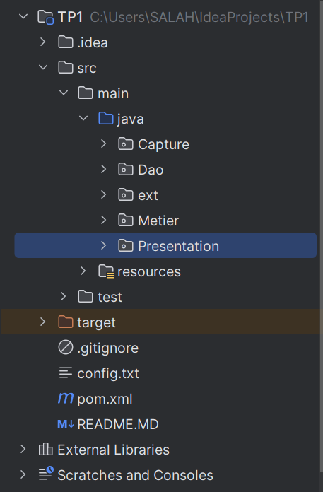

<h3>Injection des dépendances avec Spring IOC - XML et Annotations </h3>
<h4>Description du Projet </h4>

Ce projet illustre l'utilisation de l'injection des dépendances en Java avec Spring IoC (« Inversion of Control »). Il est organisé en trois couches :

<ul>
<li>DAO (Accès aux données)</li>
<li>Métier (Traitement logique)</li>
<li>Présentation (Affichage des résultats)</li>
</ul>

L'objectif est de montrer différentes manières d'instancier et d'injecter des dépendances en utilisant et en évitant l'utilisation de new, et en passant par Class.forName(), la configuration XML de Spring et enfin les annotations.

<h3>Structure du Projet</h3>

<ul>
    <li>Avant l'injection des dépendances : utilisation de `new` pour instancier les objets.</li>
    <li>Remplacement de `new` par `Class.forName()` pour éviter le couplage fort.</li>
    <li>Utilisation de Spring avec un fichier XML ("config.xml").</li>
    <li>Injection des dépendances avec les annotations `@Service`, `@Repository` et `@Qualifier`...</li>
</ul>
<h3>Exécution du Projet</h3>
<ul>
    <li>Sans Spring : Exécute Presentation.java avec new et Exécute PresentationV2.java sans new</li>
    <li>Avec XML : Charge le contexte config.xml et exécute PresAvecSpringXML.java.</li>
    <li>Avec Annotations : Exécute PresSpringAnnotation.java</li>
</ul>

Diagramme de classe 

<h2>AUTEUR : SALAHEDDINE BACHA</h2>

